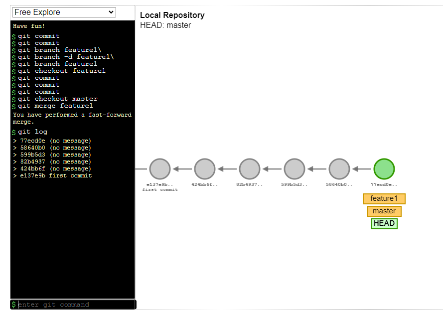
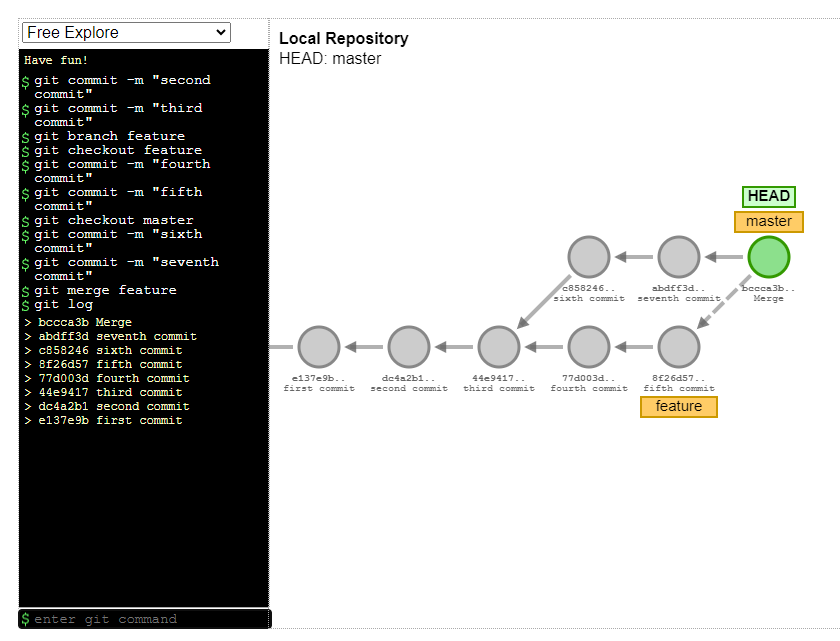

<!DOCTYPE html>
<html>
<head>
  <link rel="stylesheet" type="text/css" href="styles.css">
</head>
<body>

# [Master Git and Github - Beginner to Expert](udemy.com/course/git-and-github-for-absolute-beginners/)

## GIT Commands

### SETUP

#### Configuring user information used across all local repositories.

> Set a name that is identifiable for credit when review version history

```
git config --global user.name "[firstname lastname]"
```

> Set an email address that will be associated with each history marker

```
git config --global user.email "[valid-email@mail.com]"
```

> Set automatic command line coloring for Git for easy reviewing

```
git config --global color.ui auto
```

> Show GIT user name and email

```
git config user.name
git config user.email
```

---

### INIT

#### Configuring user information, initializing and cloning repositories

> Initialize an existing directory as a Git repository and enables local folders to execute git commands.

```
git init
```

> Retrieve an entire repository from a hosted location via URL

```
git clone [url]
```

> Shows the url repo, shows nothing if there's no remote url.

```
git remote --v
```

> Associate a remote repository with local Git repository

```
git remote add origin REPOSITORY_URL
```

> git push -u origin master/main is used to push/ upload all the codes to the remote repository from local repository

```
git push -u origin master/main
```

<hr  style="width: 50%; margin: 0 auto;">

### STAGE

```
git add .
git commit -m'message'

git status

git reset --soft HEAD^ can go back to the staging area
git reset HEAD^ can go back to the working directory
git reset --hard HEAD^ delete all the changes that you made

```

#### Reset

> Soft Reset (Preserve changes as uncommitted):

```
git reset --soft HEAD~1
```

> Mixed Reset (Preserve changes as modified but uncommitted):

```
git reset --mixed HEAD~1
```

> Hard Reset (Discard all changes):

```
git reset --hard HEAD~1
```

`NOTE: If you want to delete the last commit but you have already pushed the code into remote(GitHub) and want to delete the changes(commit) from remote as well, then you need to run the following command`

```
git push origin <branch-name> --force
```

`After deleting the last commit locally, your local and remote repositories will be out of sync. To update the remote repository, you will need to force-push the changes. `

<hr  style="width: 50%; margin: 0 auto;">
### GIT Version Control

> git log shows all the commits including author, date, commit and commit id

```
git log
```

> git log --oneline shows all the commits including only commit and commit id

```
git log --oneline
```

> git checkout commit_id switches to the branch specified by the commit id

```
git checkout commit_id
```

> When we switch to other branches, git log will not show all logs from a non master branch. git checkout master switches to the master branch or the last committed branch and we can find all the commits by using git log

```
git checkout master
```

> The git show command is used in Git to display detailed information about a specific commit. If not specified, it shows the details of the last commit. git show HEAD does the same thing though.

```
git show commit_id
```

> GIT Workflow
> 

#### Difference between git pull and git fetch

> "Pull" and "fetch" are also terms commonly used in the context of version control systems like Git. They involve getting changes from a remote repository to your local machine, but they work slightly differently:

> Pull:
> When you pull, you are essentially fetching the changes from a remote repository and merging them into your current working branch in a single step.
> A pull will update your local working branch with the changes from the remote repository and potentially merge them with your local changes.

```
git pull
```

> Fetch:
> When you fetch, you're retrieving changes from a remote repository and bringing them to your local repository. These changes are not automatically merged with your local working branch. Fetching is a safe operation, as it doesn't alter your local working branch in any way. It allows you to see what changes have been made in the remote repository without integrating them into your current work.

```
git fetch
```

<hr  style="width: 50%; margin: 0 auto;">

### SSH Keygen

> SSH - run this command from your terminal to get a pub file which contains the key. and provide a password while creating, which will be required later cloning using the ssh key

```
ssh-keygen -t ed25519 -C "your_email@example.com"
```

> a pub file will generate in specified directory and then we need to create a new ssh and use this key in GitHub SSH Keys from the setting remotely

> Using a SSH key we can securely clone repositories by using the following command. Now you need to provide password to clone the repo.

```
git clone ssh_link
```

<hr  style="width: 50%; margin: 0 auto;">

### Git Branching and Merging

#### Branching

> Branches allow to work on different parts of a project without impacting the main branch. If we want to fix a bug, then creating a branch and fixing the bug here will not affect the main branch.

> git branch shows all the branches that we have in a repository. asterisk(\*) denotes the current/active branch

```
git branch
```

> git branch -r shows all the remote branches that we have in a repository

```
git branch -r
```

> git branch -a shows all branches including remote and local that we have in a repository

```
git branch -a
```

> git branch branch_name creates a new branch according to the given name. git branch feature1 creates a new branch called feature1.

```
git branch branch_name
```

> git branch -d feature1 is used to DELETE the branch when its not necessary anymore as it has been merged already

```
git branch -d feature1
```

> git checkout feature1 switches to feature1 branch from master/current branch. And feature1 has all the files of master branch after switching. So basically its a copy of master branch.  
> git checkout -b branch_name creates a new branch and switches into in it in one command.

```
git checkout branch_name
git checkout -b branch_name
```

`NOTE: After switching to a non master branch, we can add new tasks and then commit it and switch back to master branch where we will not find the new added tasks from feature1 branch until we merge from the master branch.`

#### Merging

> git merge feature1 command will merge the new tasks that has been added in feature1 branch to the master branch.

```
git merge branch_name
```

`
NOTE: Before merging we need to switch to master branch first`

> git push -u origin feature2 pushes the branch along with the files in remote repository. Then we can create pull request from github and merge pull request to merge the files from feature2 branch.

```
git push -u origin branch_name
```

`NOTE: If we merge this way, we need to pull from local repository before we add new files to get the updated files. We can do this by git pull command. It is better to use git pull before starting to work in group projects cause others might add new codes from different branches.`

```
git pull
```

#### Two way merge / fast forward merge

`If we commit multiple times in a branch then while merge it from the master branch it performs a fast forwarded merge. The command is ordinary merge command: git merge branch_name`

`NOTE: In two way merge there will be no extra commit after merging. But in three way merge there will be an extra commit while merging.`



> For the visualization:

```
https://git-school.github.io/visualizing-git/
```

#### Three way merge

`When we create a branch and do a few commits and our project partner also commits in the master branch at the same time, then this kind of situation(three way) happens. In this situation we can merge from the master branch and this time merging will create a automatic commit`



#### What is Merge Conflict?

> Scenario: Master branch has a story.txt file which contains 2 lines of code. Then we have switched to feature branch. Now feature branch has the same code as master branch. In this branch, 3rd line has been added. Then switched to master branch. In master branch, we have added another 3rd line before merging the feature branch with master branch. THIS CAUSES MERGE CONFLICT. Now we need to resolve conflict first.
> 

> Merge conflict can be resolved by vs code or manually from GitHub by removing the code. Accepting current changes adds the changes of master branch as we merge from this branch. Accepting incoming changes adds the changes from another branches.


<hr  style="width: 50%; margin: 0 auto;">

### Contribution and Collaboration

#### Contribution

> To contribute to others project at first we need to fork the repository then clone it. It will basically clone the master branch of that repository. Then we can update the project from local machine and push it to remote forked repository. Then clicking on contribution we will be able to open pull request and create one. Now its up to the author of the project whether they are gonna accept the change or not.

```
fork repo - clone - add/update - push to remote - contribute - open pull request - create
```
#### Collaboration


<div class="line"></div>
### Git Ignore and Readme

`.gitignore file is used to skip files while sending to remote repo from local repo `

#### Readme

> 2 spaces after the end of the backtick creates new line for next

`git add .`  
`git commit -m`  
`git push`

#### We can write html and CSS here

```html
<h1>HTML Element </h2>
```

```css
h1 {
  color: red;
}
```

#### We can create ordered and unordered list here

#### Todo:

1. Add all commands according to their tasks
2. Add an image
3. SSH Key

- Unordered 1
- Unordered 2
  - Sub 1
  - Sub 2
    - Sub 2.1
- Unordered 3

<p style='color:red'>This is some red text.</p>
<font color="red">This is some text!</font>
These are <b style='color:red'>red words</b>.

</body>
</html>
