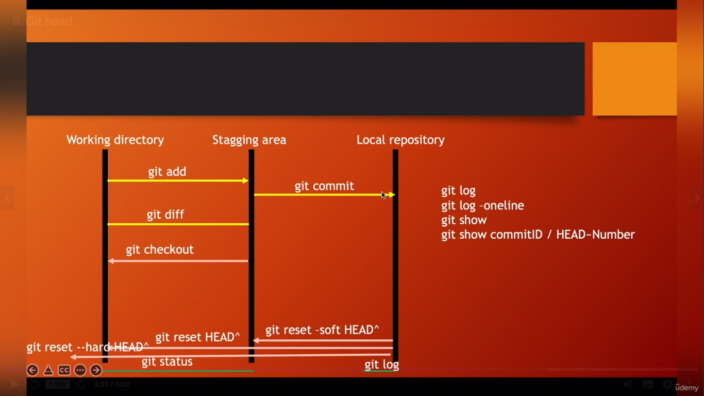

# [Master Git and Github - Beginner to Expert](udemy.com/course/git-and-github-for-absolute-beginners/)

## GIT Commands
### SETUP
#### Configuring user information used across all local repositories.
> Set a name that is  identifiable for credit when review version history 
```
git config --global user.name "[firstname lastname]" 
```
> Set an email address that will be associated with each history marker
```
git config --global user.email "[valid-email@mail.com]" 
```
> Set automatic command line coloring for Git for easy reviewing
```
git config --global color.ui auto 
```
> Show GIT user name and email
```
git config user.name
git config user.email
```

### INIT
#### Configuring user information, initializing and cloning repositories
> Initialize an existing directory as a Git repository and enables local folders to execute git commands.
```
git init
```
> Retrieve an entire repository from a hosted location via URL

```
git clone [url]
```

> Shows the url repo, shows nothing if there's no remote url.
```
git remote --v 
```
> Associate a remote repository with local Git repository
``` 
git remote add origin REPOSITORY_URL
```
> git push -u origin master/main is used to push/ upload all the codes to the remote repository from local repository
```
git push -u origin master/main
```


### STAGE 
```
git add .
git commit -m'message'

git status

git reset --soft HEAD^ can go back to the staging area
git reset HEAD^ can go back to the working directory
git reset --hard HEAD^ delete all the changes that you made

```
### GIT Version Control 

> git log shows all the commits including author, date, commit and commit id

```
git log 
```
> git log --oneline shows all the commits including only commit and commit id
```
git log --oneline
```
> git checkout commit_id switches to the branch specified by the commit id
```
git checkout commit_id
```
> When we switch to other branches, git log will not show all logs from a non master branch. git checkout master switches to the master branch or the last committed branch and we can find all the commits by using git log
```
git checkout master
```
> The git show command is used in Git to display detailed information about a specific commit. If not specified, it shows the details of the last commit. git show HEAD does the same thing though.
```
git show commit_id
```
> GIT Workflow



```
git pull
```
### SSH Keygen
> SSH 

```
ssh-keygen -t ed25519 -C "your_email@example.com"
```
> a pub file will generate in specified directory and then we need to use this key in GitHub SSK Keys from the setting remotely

> Using a SSH key we can securely clone repositories by using the following command. Now you need to provide password to clone the repo.
```
git clone ssh_link
```

`.gitignore file is used to skip files while sending to remote repo from local repo `

## 2 spaces after the end of the backtick creates new line for next 
`git add .`  
`git commit -m`  
`git push`

## We can write in multiline using 3 backticks 
```
git add .
git commit -m"message"
git push
```
## We can write html and CSS here
```html
<h1>HTML Element </h2>
```

```css
h1{
    color: red
}
```

## We can create ordered and unordered list here
### Todo: 
1. Add all commands according to their tasks
2. Add an image
3. SSH Key

- Unordered 1
- Unordered 2
   - Sub 1
   - Sub 2
     - Sub 2.1
- Unordered 3
 
<p style='color:red'>This is some red text.</p>
<font color="red">This is some text!</font>
These are <b style='color:red'>red words</b>.